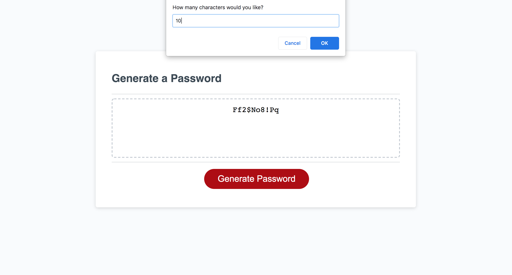

Password Generator

What was your motivation? This assignment was a new and intresting.

Why did you build this project?
This homework assignment help me get familiar with how a password generator works.
What problem does it solve? It help solve the steps to create a funtional password generator .

What did you learn? A better understanding of functions and arrays.

[Link to deployable application](https://jose8160.github.io/homework-3/)

